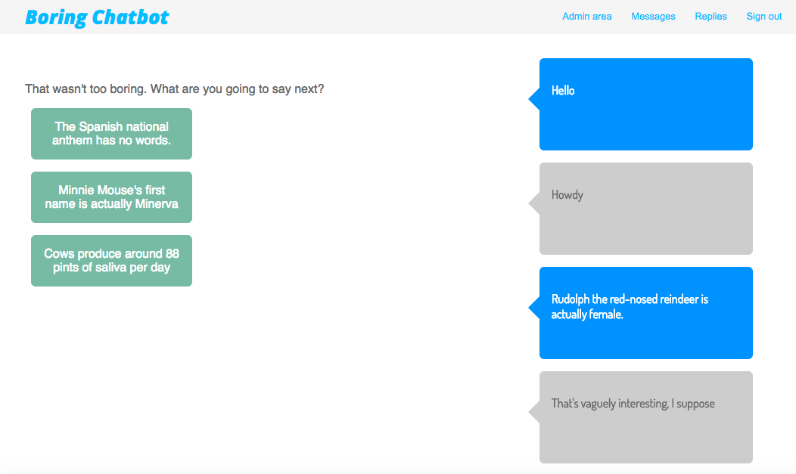

# Boring Chatbot

This is the Boring Chatbot, which decides whether you are boring or not.



**Ruby version:** 2.4.1

**Rails version:** 5.1.2

**Test framework:** RSpec

## How to run

In your terminal, enter:
`git clone git@github.com:freddyfallon/boring_chatbot.git`

Then run `bundle install`

Then set the database up with `bin/rails db:create db:migrate`

Then you can start the server by running `bin/rails server`

You can then visit the chatbot at  [http://localhost:3000](http://localhost:3000)

You can also run the tests using rspec with the command `rspec`

## My approach

I made the decision to have two models, messages and replies, which have two properties. In the case of the message, it has a boring level, which measures how boring the message is, along with a stage which indicates which stage of the chat the message should appear.

I decided that the flow of the chat should take place within a single page, which proved difficult. I ended up using JQuery for the logic on the front-end, which meant that there was more business logic taking place around the view than I would have liked.

I also created the admin section and made it link to two separate areas to control the messages and replies. From a user-experience point of view, this feels a little jarring, but I did my best to try to make it as logical as possible.

## User stories

```
As a user
I want to be able to see a first message
So that I can chat to the chatbot
```

```
As a user
I want to see a reply to my first message
So that I can feel like I'm having a conversation

```

```
As a user
I want some message options
So that I can send the chatbot something interesting

```

```
As a user
I want to see a relevant reply
So that I can see how interesting I am being

```

```
As a user
I want the game to end when I say something really boring
So that I can learn from my mistakes

```

```
As a user
I want the game to end when I have sent a few interesting messages
So that I can feel happy that I'm an interesting person

```

```
As an admin
I want to be able to log in
So that I can administer the chat experience

```

```
As an admin
I want to view, edit and delete messages and replies
So that I can manage the flow of the chatbot

```

```
As an admin
I want set the boring level of a message
So that I can manage the flow of the game

```

```
As an admin
I want set the tolerance level of a reply
So that I can manage the flow of the game

```

```
As an admin
I want to add new messages and replies
So that I can add my own interesting content to the chat experience

```


## Successes

This tech test gave me the opportunity to practice some front-end styling, which I had not done a lot of before. I also felt that the look and feel of the chat experience was reasonably strong.

It also helped me identify some gaps in my knowledge to look at later, which was valuable in itself. I am going to spend some time exploring how to write API endpoints and work with Rails routes more effectively and how to work with AJAX.

## Challenges

I was concerned that I would have trouble getting a Rails app up and running after spending quite a bit of time away from it, but it proved easier than expected. My main challenge was around creating a single page app in Rails, and I had a large amount of difficulty taking logic out of the view. I ended up using JQuery to render items on the page, which felt like a bit of a hack.
